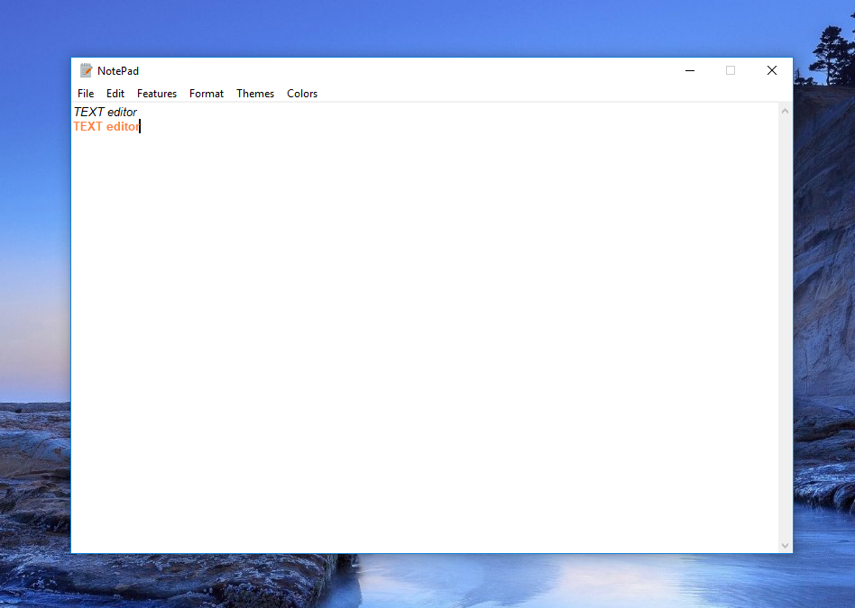

# super-notepad
TextEditor program with SpeechRecognition, Text to Speech features\
and other features

## Done by
Bolot Zhusubpekov\
Kalmyrza Zholchubekov

## Installation

In the terminal use the package manager [pip](https://pip.pypa.io/en/stable/) to install modules.

```
pip install pipwin
```
```
pipwin install pyaudio
```
```
pip install SpeechRecognition
```
```
pip install gTTS
```
## Usage

1.Download logo and audiofile to your folder


[audio](T22S.wav)\

2. After running should appear texteditor window


